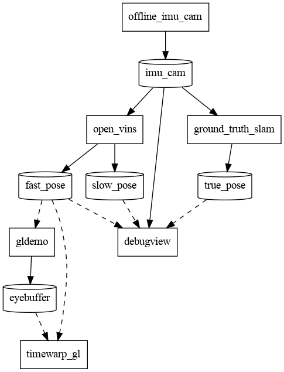

# Default Plugins

- `offline_imu_cam`: Reads IMU data and images from files on disk, emulating a real sensor on the
  headset (with emulated timing).

- `ground_truth_slam`: Reads the ground-truth from the same dataset to compare our output against
  (uses timing from `offline_imu_cam`).

- `open_vins`: Runs [OpenVINS][1] on the input, and outputs a the headset's pose.

- `gldemo`: Renders a static scene (into left and right eyebuffers) given the pose from `open_vins`.

- `timewarp_gl`: [Asynchronous reprojection][2] of the eyebuffers.

- `debugview`: Renders a frame for debug information.

Below this point, I will use Switchboard terminology. Read the API documentation on switchboard for definitions.

- In the above figure, rectangles are plugins, cylinders are topics (the graph is bipartitioned
  between these two gorups).

- Solid arrows from plugins to topics represent publishing.

- Solid arrows from topics to plugins represent synchronous reading. They take some action for
  _every_ event which gets published on the topic.

- Solid arrows from topics to plugins represent asynchronous reading. They need to know just the
  _latest_ event on their topic.

- Imagine the topic as a trough filing with events from its publisher, being drained by its
  synchronous readers (AKA subscribers), while asynchronous readres just skim from the top.

See `writing_your_plugin.md` to extend ILLIXR.

[1]: https://docs.openvins.com/
[2]: https://en.wikipedia.org/wiki/Asynchronous_reprojection
