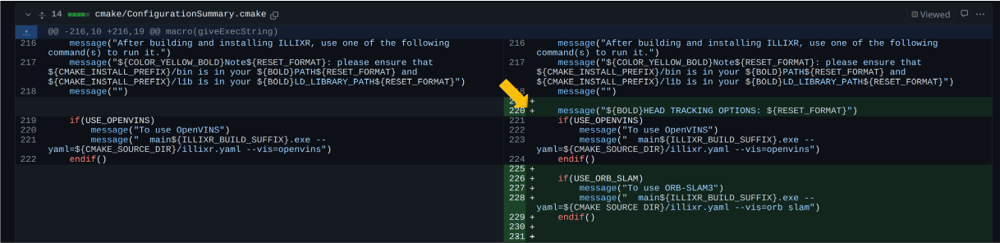

# Code Review Guidelines

The point of code reviews is to make sure changes to ILLIXR are compatible with the vision of the project, are well
coded

If you are asked to review code for a pull request please:

- Review the code not the author
- Critique the code in a constructive format
- If possible offer suggestions/examples for changes or specific points, do not just say `this doesn't work`
- If any questions are asked, be specific, feel free to ask several questions
- If critiques/questions deal with a specific section of code, start a conversation in that part of the code by clicking
  on the `+` for the line of code in question

If your code is being reviewed:

- Every pull request must have reviews done by two people who are not the author of the pull request
- Don't take criticisms personally
- Please respond to any conversations, don't just close them
- Remember the review process is to improve your code
