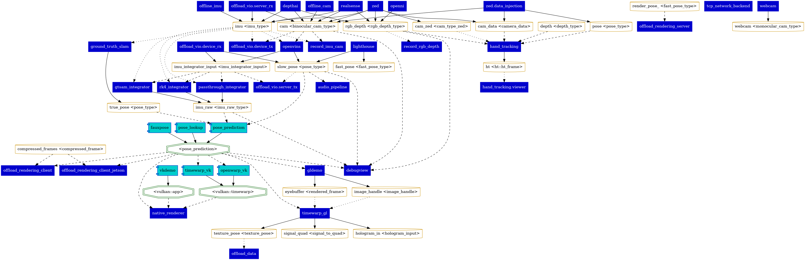

{ .on-glb }
**Current dataflow between all plugins and services.** Dark blue boxes represent plugins and cyan  component boxes represent services. Data types are represented with cylinders and labelled as `topic <data_type>`. Service data types are represented by octagons. Solid lines point from the plugin/service which publishes them to the data type. Dashed lines point from data types to the plugin/service which reads them *synchronously*. Dotted lines point from data types to the plugin/service which reads them *asynchronously*.
