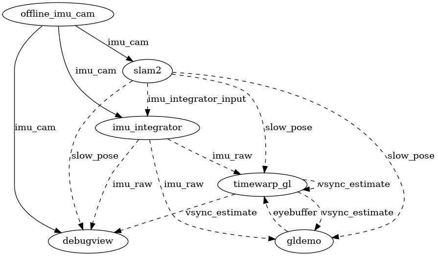

# ILLIXR plugins

This page details the structure of ILLIXR's [_plugins_][41] and how they interact with each other.

## Default Plugins

-   [`audio_pipeline`][8]:
    Launches a thread for [binaural][19] recording and one for binaural playback.
    Audio output is not yet routed to the system's speakers or microphone,
    but the plugin's compute workload is still representative of a real system.
    By default this plugin is enabled (see `native` [_configuration_][40]).

    Topic details:

    -   *Calls* `pose_prediction`.

-   [`debugview`][7]:
    Renders incoming [_frames_][34] from the graphics pipeline for debugging live executions of the application.

    Topic details:

    -   *Calls* `pose_prediction`.
    -   Asynchronously *reads* `fast_pose` on `imu_raw` topic. ([_IMU_][36] biases are unused).
    -   Asynchronously *reads* `slow_pose` on `slow_pose` topic.
    -   Synchronously *reads* `imu` on `imu` topic.
    -   Asynchronously *reads* buffered `cam_type` on `cam` topic.

-   [`gldemo`][5]:
    Renders a static scene (into left and right [_eye buffers_][34]) given the [_pose_][37]
    from `pose_prediction`.

    Topic details:

    -   *Calls* `pose_prediction`.
    -   *Publishes* `rendered_frame` on `eyebuffer` topic.
    -   Asynchronously *reads* `time_type` on `vsync_estimate` topic.

-   [`ground_truth_slam`][3]:
    Reads the [_ground truth_][34] from the same dataset as the `offline_imu` plugin.
    Ground truth data can be compared against the measurements from `offline_imu` for accuracy.
    Timing information is taken from the `offline_imu` measurements/data.

    Topic details:

    -   *Publishes* `pose_type` on `true_pose` topic.
    -   Asynchronously *reads* `imu_type` on `imu` topic.

-   [`gtsam_integrator`][12]:
    Integrates over all [_IMU_][36] samples since the last published [_SLAM_][39] pose to provide a
    [_fast pose_][37] every time a new IMU sample arrives using the GTSAM library ([upstream][11]).

    Topic details:

    -   *Publishes* `imu_raw_type` on `imu_raw` topic.
    -   Synchronously *reads/subscribes* to `imu_type` on `imu` topic.
    -   Asynchronously *reads* `imu_integrator_input` on `imu_integrator_input` topic.

-   [`offline_imu`][1]:
    Reads [_IMU_][36] data files on disk, emulating a real sensor on the [_headset_][38]
    (feeds the application input measurements with timing similar to an actual IMU).

    Topic details:

    -   *Publishes* `imu_type` on `imu` topic.

-   [`offline_cam`][2]:
    Reads camera images from files on disk, emulating real cameras on the [_headset_][38]
    (feeds the application input measurements with timing similar to an actual camera).

    Topic details:

    -   *Publishes* `cam_type` on `cam` topic.
-   [`pose_prediction`][17]:
    Uses the latest [_IMU_][36] value to predict a [_pose_][37] for a future point in time.
    Implements the `pose_prediction` service (defined in `common`),
        so poses can be served directly to other plugins.

    Topic details:

    -   Asynchronously *reads* `pose_type` on `slow_pose` topic,
            but it is only used as a fallback.
    -   Asynchronously *reads* `imu_raw` on `imu_raw` topic.
    -   Asynchronously *reads* `pose_type` on `true_pose` topic,
            but it is only used if the client asks for the true pose.
    -   Asynchronously *reads* `time_type` on `vsync_estimate` topic.
        This tells `pose_predict` what time to estimate for.

-   [`timewarp_gl`][6]:
    [Asynchronous reprojection][35] of the [_eye buffers_][34].
    The timewarp ends just after [_vsync_][34], so it can deduce when the next vsync will be.

    Topic details:

    -   *Calls* `pose_prediction`.
    -   Asynchronously *reads* `rendered_frame` on `eyebuffer` topic.
    -   *Publishes* `time_type` on `vsync_estimate` topic.
    -   *Publishes* `hologram_input` on `hologram_in` topic.
    -   *Publishes* `texture_pose` on `texture_pose` topic if `ILLIXR_OFFLOAD_ENABLE` is set in the env.

Below this point, we will use Switchboard terminology.
Read the [API documentation on _Switchboard_][32] for more information.

-   In the above figure, ovals are plugins.

-   Solid arrows from plugins to topics represent publishing.

-   Solid arrows from topics to plugins represent synchronous reading.
    Some action is taken for _every_ event which gets published on the topic.

-   Dashed arrows from topics to plugins represent asynchronous reading.
    Plugin readers only need the _latest_ event on their topic.

-   Imagine the topic as a trough filling with events from its publisher.
    Synchronous readers (AKA subscribers) drain the trough,
        while asynchronous readers just skim fresh events off the top of the trough.

See [Writing Your Plugin][30] to extend ILLIXR.

## Other Supported Plugins
ILLIXR supports additional plugins to replace some of the default plugins.

-   [`fauxpose`][42]:
    An alternate tracking implementation that simply generates "fast_pose"
    data from a simple mathematical algorithm (circular movement).  The intent
    is for use when debugging other plugins and the developer wants a known
    pose trajectory without having to configure actual tracking.

    Topic details:
    -   *Publishes* `pose_position` on `fast_pose` topic.

-   [`hologram`][9]:
    Adapts the eyebuffer for use on a holographic display.
    By default, this plugin is disabled, since an NVIDIA GPU is currently required.

    Topic details:

    -   Asynchronously *reads* `hologram_input` on `hologram_in` topic.
        Hologram is too slow to run for every input,
            so the plugin implements an asynchronous reader which can drop inputs.

-   [`offload_data`][21]:
    Writes [_frames_][34] and [_poses_][37] output from the [_asynchronous reprojection_][35] plugin to disk for analysis.

    Topic details:

    -   Synchronously *reads* `texture_pose` on `texture_pose` topic.

-   [`open_vins`][4]:
    An alternate [_SLAM_][39] ([upstream][18]) implementation that uses a MSCKF
        (Multi-State Constrained Kalman Filter) to determine poses via camera/[_IMU_][36].

    Topic details:

    -   *Publishes* `pose_type` on `slow_pose` topic.
    -   *Publishes* `imu_integrator_input` on `imu_integrator_input` topic.
    -   Synchronously *reads*/*subscribes* to `imu_type` on `imu` topic.

-   [`pose_lookup`][20]:
    Implements the `pose_predict` service, but uses [_ground truth_][33] from the dataset.
    The plugin peeks "into the future" to determine what the exact [_pose_][37] will be at a certain time.

    Topic details:

    -   Asynchronously *reads* `time_type` on `vsync_estimate` topic.
        This tells `pose_lookup` what time to lookup.

-   [`realsense`][23]:
    Reads images and [_IMU_][36] measurements from the [Intel Realsense][25].

    Topic details:

    -   Same interface as `zed`.

-   [`rk4_integrator`][16]:
    Integrates over all [_IMU_][36] samples since the last published [_SLAM_][39] [_pose_][37] to
        provide a [_fast pose_][37] every time a new IMU sample arrives using RK4 integration.

    Topic details:

    -   Same interface as `gtsam_integrator`.

-   [`zed`][22]:
    Reads images and [_IMU_][36] measurements from the [ZED Mini][24].
    Unlike `offline_imu`, `zed` additionally has RGB and [_depth_][34] data.
    Note that this plugin implements two threads: one for the camera, and one for the IMU.

    Topic details:

    -   *Publishes* `imu_type` on `imu` topic.
    -   *Publishes* `rgb_depth_type` on `rgb_depth` topic.

See [Getting Started][31] for more information on adding plugins to a [_profile_][40] file.

[//]: # (- References -)

[1]:    https://github.com/ILLIXR/ILLIXR/tree/master/offline_imu
[2]:    https://github.com/ILLIXR/ILLIXR/tree/master/offline_cam
[3]:    https://github.com/ILLIXR/ILLIXR/tree/master/ground_truth_slam
[4]:    https://github.com/ILLIXR/open_vins
[5]:    https://github.com/ILLIXR/ILLIXR/tree/master/gldemo
[6]:    https://github.com/ILLIXR/ILLIXR/tree/master/timewarp_gl
[7]:    https://github.com/ILLIXR/ILLIXR/tree/master/debugview
[8]:    https://github.com/ILLIXR/audio_pipeline/tree/illixr-integration
[9]:    https://github.com/ILLIXR/HOTlab/tree/illixr-integration
[11]:   https://gtsam.org/
[12]:   https://github.com/ILLIXR/ILLIXR/tree/master/gtsam_integrator
[16]:   https://github.com/ILLIXR/ILLIXR/tree/master/rk4_integrator
[17]:   https://github.com/ILLIXR/ILLIXR/tree/master/pose_prediction
[18]:   https://docs.openvins.com
[19]:   https://en.wikipedia.org/wiki/Binaural_recording
[20]:   https://github.com/ILLIXR/ILLIXR/tree/master/pose_lookup
[21]:   https://github.com/ILLIXR/ILLIXR/tree/master/offload_data
[22]:   https://github.com/ILLIXR/ILLIXR/tree/master/zed
[23]:   https://github.com/ILLIXR/ILLIXR/tree/master/realsense
[24]:   https://www.stereolabs.com/zed-mini
[25]:   https://www.intelrealsense.com/depth-camera-d435

[//]: # (- Internal -)

[30]:   writing_your_plugin.md
[31]:   getting_started.md
[32]:   api/html/classILLIXR_1_1switchboard.html
[33]:   glossary.md#ground-truth
[34]:   glossary.md#framebuffer
[35]:   glossary.md#asynchronous-reprojection
[36]:   glossary.md#inertial-measurement-unit
[37]:   glossary.md#pose
[38]:   glossary.md#head-mounted-display
[39]:   glossary.md#simultaneous-localization-and-mapping
[40]:   glossary.md#profile
[41]:   glossary.md#plugin
[42]:	plugin_README/README_fauxpose.md
