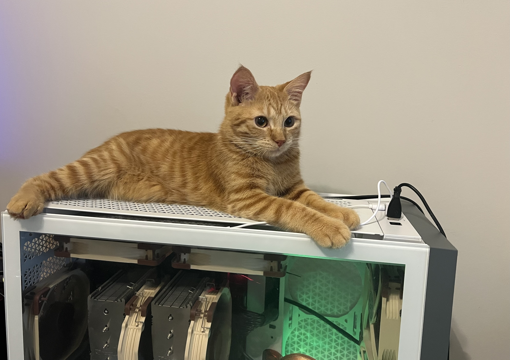

# Ada Setup and Run Guide

Thank you for your interest in **Ada** :
[Ada: A Distributed, Power-Aware, Real-Time Scene Provider for XR](https://rsim.cs.illinois.edu/Pubs/25-TVCG-Ada.pdf).

This guide provides step-by-step instructions to set up and run the Ada system within the [ILLIXR](https://illixr.org) testbed, using the ScanNet dataset.

---

## 1) Installation
Before building Ada, make sure the following dependencies are installed:
- **ILLIXR:** latest `main` branch
- **Jetson Orin (device):**
  - JetPack ≥ 5.1.3
  - DeepStream ≥ 6.3
  - CUDA ≥ 11.4
- **Server:**
  - Clang ≥ 10.0.0
  - CUDA ≥ 11.4
  - DeepStream = 6.3


### 1.1 Build and Install Ada Components in ILLIXR

#### Step 1: Clone ILLIXR
```bash
git clone git@github.com:ILLIXR/ILLIXR.git
cd ILLIXR
```

#### Step 2 Configure the Build
Create a build directory and run cmake with Ada components enabled.

Replace /path/to/install with the installation directory of your choice.

```bash
mkdir build && cd build
cmake .. \
  -DCMAKE_INSTALL_PREFIX=/path/to/install \
  -DBUILD_SHARED_LIBS=ON \
  -DUSE_ADA.OFFLINE_SCANNET=ON \
  -DUSE_TCP_NETWORK_BACKEND=ON \
  -DUSE_ADA.DEVICE_TX=ON \
  -DUSE_ADA.DEVICE_RX=ON \
  -DUSE_ADA.SERVER_RX=ON \
  -DUSE_ADA.SERVER_TX=ON \
  -DUSE_ADA.INFINITAM=ON \
  -DUSE_ADA.MESH_COMPRESSION=ON \
  -DUSE_ADA.MESH_DECOMPRESSION_GREY=ON \
  -DUSE_ADA.SCENE_MANAGEMENT=ON \
  -DCMAKE_BUILD_TYPE=Release
```

### Step 3: Build
```bash
cmake --build . -j8
```
(Adjust -j8 based on the number of cores on your machine.)

### Step 4: Install
```bash
cmake --install .
```

### Step 5: Update Environment Variables
Add the install folder’s lib directory to your LD_LIBRARY_PATH:
```bash
export LD_LIBRARY_PATH=/path/to/install/lib:$LD_LIBRARY_PATH
```
(Add the above line to your .bashrc or .zshrc for persistence across sessions.)


## 2) Setting up Ada
To run Ada, you’ll need a device with Jetson-class hardware and a server with an NVIDIA GPU.
Below are the configurations we used for reproducibility in the Ada paper.

**Hardware**
- **Device (required):** NVIDIA Jetson Orin AGX
  (Ada relies on Jetson’s NVENC/NVDEC capabilities for depth encoding.)
- **Server (flexible):** Any machine with an NVIDIA GPU
  (we used an RTX 3080 Ti for our experiments, but other GPUs also work).


## 3) ILLIXR Configuration
Ada runs as a set of ILLIXR plugins. To launch it, you need to provide configuration files that specify
which plugins to load, where to find the dataset, and Ada specific tuning parameters.

The `ada_device` and `ada_server` profiles default to eight mesh chunks, eight
compression workers on the server, eight decompression workers on the device, and
`ILLIXR_RECORD_LOGGING: "0"`. Copy these settings into custom configurations.
To change a default, edit the corresponding value in your configuration file.

### Example Device Configuration File
```yaml
plugins: ada.offline_scannet,tcp_network_backend,ada.device_tx,ada.device_rx,ada.mesh_decompression_grey,ada.scene_management
env_vars:
  ADA_REQUIRE_WIFI_POWER_SAVE_OFF: true
  ILLIXR_RECORD_LOGGING: "0"
  ILLIXR_RUN_DURATION: 1200
  ILLIXR_DATA: /home/illixr/Downloads/scannet_0005
  FRAME_COUNT: 1158
  FPS: 15
  PARTIAL_MESH_COUNT: 8
  MESH_DECOMPRESS_PARALLELISM: 8
  ILLIXR_TCP_SERVER_IP:  127.0.0.1
  ILLIXR_TCP_SERVER_PORT: 9000
  ILLIXR_TCP_CLIENT_IP: 127.0.0.1
  ILLIXR_TCP_CLIENT_PORT: 9001
  ILLIXR_IS_CLIENT: 1
  ENABLE_OFFLOAD: false
  ENABLE_ALIGNMENT: false
  ENABLE_VERBOSE_ERRORS: false
  ENABLE_PRE_SLEEP: false
```

### Example Server Configuration File
```yaml
plugins: tcp_network_backend,ada.server_rx,ada.server_tx,ada.infinitam,ada.mesh_compression
env_vars:
  ILLIXR_RECORD_LOGGING: "0"
  ILLIXR_RUN_DURATION: 1200
  ILLIXR_DATA: /home/illixr/Downloads/scannet_0005
  FRAME_COUNT: 1158
  FPS: 15
  PARTIAL_MESH_COUNT: 8
  MESH_COMPRESS_PARALLELISM: 8
  ILLIXR_TCP_SERVER_IP:  127.0.0.1
  ILLIXR_TCP_SERVER_PORT: 9000
  ILLIXR_TCP_CLIENT_IP: 127.0.0.1
  ILLIXR_TCP_CLIENT_PORT: 9001
  ILLIXR_IS_CLIENT: 0
  ENABLE_OFFLOAD: false
  ENABLE_ALIGNMENT: false
  ENABLE_VERBOSE_ERRORS: false
  ENABLE_PRE_SLEEP: false
```
The above examples set the following environment variables:

 - **ADA_REQUIRE_WIFI_POWER_SAVE_OFF**: `true` makes the Ada client check Wi-Fi power saving before starting the pipeline. If it is on, startup stops and prints the command to disable it. Set `false` to skip this check.
 - **ILLIXR_RECORD_LOGGING**: `"0"` disables ILLIXR structured performance records; set `"1"` to enable them. Ada timing CSVs and diagnostic messages are controlled separately.
 - **ILLIXR_RUN_DURATION**: how long you want to run ILLIXR (in seconds)
 - **ILLIXR_DATA**: the location of the data set
 - **FRAME_COUNT**: the number of frames in your dataset
 - **FPS**: how often you want to trigger proactive scene extraction (Sec 4.2 in the paper)
 - **PARTIAL_MESH_COUNT**: number of mesh chunks per extraction (Sec 4.4 in the paper); use the same value on both sides
 - **MESH_COMPRESS_PARALLELISM**: number of server compression workers; should match PARTIAL_MESH_COUNT
 - **MESH_DECOMPRESS_PARALLELISM**: number of device decompression workers
 - **ILLIXR_TCP_SERVER_IP**: the IP address of the server (can be localhost if testing on one machine)
 - **ILLIXR_TCP_SERVER_PORT**: the port the server should use (your choice)
 - **ILLIXR_TCP_CLIENT_IP**: the IP address of the device (can be localhost if testing on one machine)
 - **ILLIXR_TCP_CLIENT_PORT**: the port the device should use (your choice, must be different from the server port)
 - **ILLIXR_IS_CLIENT**: 1 for device, 0 for server

#### What differs between device and server?

The plugin set (device loads offline_scannet, rx/tx, decompression, scene management; server loads rx/tx, InfiniTAM, compression).

The role flag: ILLIXR_IS_CLIENT = 1 (device) vs 0 (server).

### How to Understand Ada-Specific Parameters in YAML

**FPS**
  - Controls the **proactive scene extraction rate**.
  - In our paper’s evaluation, proactive extraction was triggered every *N* frames (we used **every 15 frames**).

!!!️ note
    
    this name may be confusing since it overlaps with dataset playback rate; we plan to update it in a future release.

**MESH_COMPRESS_PARALLELISM**, **MESH_DECOMPRESS_PARALLELISM**, and **PARTIAL_MESH_COUNT**

  - `MESH_COMPRESS_PARALLELISM`: number of server worker threads launched to compress mesh chunks in parallel.
  - `MESH_DECOMPRESS_PARALLELISM`: number of device worker threads launched to decode and format mesh chunks in parallel.
  - `PARTIAL_MESH_COUNT`: number of chunks the mesh is divided into; the scene management plugin expects this value.
  - Server compression workers and the chunk count **must match** in the current version.
  - Device decompression workers can differ from the chunk count. Chunks are assigned to workers by chunk ID; each completed chunk is published immediately.

### Jetson Wi-Fi Power Saving

The Ada client checks Wi-Fi power saving before constructing plugins or connecting
to the server, including when launched directly with `main.opt.exe`. This check
defaults to enabled even in custom configurations that omit
`ADA_REQUIRE_WIFI_POWER_SAVE_OFF`.

Ada detects the active wireless interface and runs the unprivileged query
`iw dev INTERFACE get power_save`. If power saving is off, startup continues.
If it is on, Ada exits with a nonzero status and prints a message on the device,
using its actual interface name and the installed `iw` path. For example:

```text
[Ada Wi-Fi] Startup stopped: Wi-Fi power saving is ON on wlan0.
Run this command in a terminal on this device:
  sudo /usr/sbin/iw dev wlan0 set power_save off
Then restart the Ada client.
```

Run the printed command yourself and restart Ada. Ada only reads the setting;
it does not run sudo, request a password, or change network settings.
The query has a two-second timeout. If `iw` is missing or the state cannot be
verified, startup stops with instructions for resolving the problem.

If multiple wireless interfaces are active, set `ADA_WIFI_INTERFACE` in your
device configuration to the interface Ada uses. With no active wireless
interface, the check is skipped. Set `ADA_REQUIRE_WIFI_POWER_SAVE_OFF: false`
to skip the check explicitly. Rebuild and install both the ILLIXR runtime and
`ada.device_rx` to use this validation before plugin construction.

To keep power saving off when Wi-Fi reconnects, you can also save the setting in
the Jetson's NetworkManager connection profile. List profiles
with `nmcli connection show --active`, then replace `YOUR_WIFI_PROFILE` below with
the active Wi-Fi connection name:

```bash
sudo nmcli connection modify "YOUR_WIFI_PROFILE" 802-11-wireless.powersave 2
sudo iw dev wlan0 set power_save off
```

The first command saves the setting for future connections; the second applies it
to the current connection without reconnecting. Replace `wlan0` if your wireless
interface has a different name. NetworkManager defines
[`802-11-wireless.powersave=2` as disabled](https://networkmanager.dev/docs/api/latest/settings-802-11-wireless.html).
This is a one-time device setup step for each Wi-Fi profile.

Check the saved setting and the current connection:

```bash
nmcli -g 802-11-wireless.powersave connection show "YOUR_WIFI_PROFILE"
iw dev wlan0 get power_save
```

The saved setting should report `disable` (value `2`), and the live setting should
report `Power save: off`.


## 4) Running Ada
To run Ada, open **two terminals** (one for the server, one for the device).
Make sure both shells have `LD_LIBRARY_PATH` set to include your ILLIXR build directory:
### Step 1: Start the Server:
```bash
./main.opt.exe -y your_server_config.yaml
```

### Step 2: Start the Device:
```bash
./main.opt.exe -y your_device.config.yaml
```

### Output:
- If you enable the `VERIFY` flag in `plugins/ada/scene_management/plugin.cpp`, Ada will write out a reconstructed mesh at the last update as `x.obj` (`x = FRAME_COUNT/FPS - 1`)
- A `recorded_data` folder will be created inside your build directory. This folder contains diagnostic and intermediate data collected during the run

### FAQ:

#### Q1: Can I use Ada on a different device than Jetson Orin?

Ada relies on GStreamer with NVIDIA’s DeepStream (NVENC/NVDEC) for efficient depth encoding.
In particular, Ada requires the `enable-lossless` flag for the `nvv4l2h265enc` / `nvv4l2h264enc` GStreamer elements.
This flag may be missing in some driver + device combinations.

- In theory, any NVIDIA GPU with Ampere or newer architecture (30xx series or Jetson Orin and above) supports this capability.
- However, software support is inconsistent across platforms.
- For devices that do not support this, we plan to release an alternative version using a prior method (16-bit depth → HSV color model → 8-bit RGB), which offers the next-best depth preservation.

#### Q2: How to Change the Scene Fidelity
To adjust scene fidelity in **Ada**:
1. Go to
`ILLIXR/build/_deps/infinitam_ext-src/ITMLib/Utils/ITMLibSettings.cpp `
2. Find line 55:
`sceneParams(0.1f, 100, 0.02f, 0.2f, 4.0f, false), // 2cm //pyh Ada used config`
    - The third parameter (0.02f in this example) controls the voxel size.
    - Smaller values → higher fidelity (e.g., 0.02f = 2 cm).
    - Larger values → lower fidelity (e.g., 0.04f = 4 cm, 0.06f = 6 cm).
3. Predefined configurations are available:
    - Line 53 → 6 cm voxel size
    - Line 54 → 4 cm voxel size
    - Line 55 → 2 cm voxel size (default in Ada)
4. After editing, rebuild ILLIXR:
  ```bash
  cmake --build . -j8
  cmake --install .
  ```
### Q3. How do I adjust the bitrate of LSB?

To modify the bitrate used by the **LSB encoder**, open  
`ILLIXR/utils/video_encoder.hpp` and locate **line 11** under the `#if defined(ADA)` block:

```cpp
#define ILLIXR_BITRATE X
```

Replace `X` with your desired bitrate value (in bits per second).

Currently, it is set to **0.5 Mbps**.  
Here are some common examples for reference:

| Target Bitrate | Value (bits per second) |
|----------------|-------------------------|
| 50 Mbps        | 52428800                |
| 20 Mbps        | 20971520                |
| 10 Mbps        | 10485760                |
| 5 Mbps         | 5242880                 |
| 2 Mbps         | 2097152                 |
| 0.5 Mbps       | 524288                  |

---

### Q4. My extracted mesh looks weird — what went wrong?

The reconstruction algorithm used in **Ada (InfinITAM)** is generally robust.  
If your extracted mesh appears **corrupted**, **distorted**, or **missing**, it usually indicates that **depth or pose information** was not passed correctly.

A **missing mesh (nothing is getting updated)** often causes a **segmentation fault**, since the compression stage expects non-empty submesh chunks.  
If you encounter a segfault, you can verify whether the mesh is missing by printing out the `face_number` variable in the **InfiniTAM plugin** located at:  
`build/_deps/infinitam_ext-src/plugin.cpp`

`face_number` is assigned around **line 184** — simply add a `printf` to check its value.  
If it prints `0`, that means the mesh is missing.

The most common culprit—based on the author’s experience—is a **version mismatch in NVENC support** across different **GStreamer** and **NVIDIA DeepStream** releases.  
Even if the pipeline is set up correctly, internal changes in GStreamer or DeepStream may alter the encoding behavior, leading to inconsistent depth reconstruction.

#### Quick diagnostic test
Use the provided helper function in `server_rx`:
```cpp
write_16_bit_to_pgm()
```

### Q5. Anything changed since the paper?

Yes. During the open-sourcing process, the author revisited and refined parts of the implementation.  

One key change concerns how **depth images** are handled in the **Most Significant Byte (MSB)** and **Least Significant Byte (LSB)** encoding paths.

In the original design, both MSB and LSB components of the depth image were converted to **YUV444** format before encoding.  
However, upon further investigation, the author realized that this is **unnecessary for the LSB path** — it can safely use **YUV420** instead.  
Because the depth information is stored entirely in the **Y channel**, the UV downsampling in YUV420 has no impact on accuracy.

As a result, in the open-source version:
- **LSB encoding** has been simplified to use **YUV420**.  
- **MSB encoding** remains in **YUV444**, since the `enable-lossless` flag only works with that format.

This change makes the LSB pipeline more efficient without affecting reconstruction quality.

In short: less code, better results, fewer regrets.

### Q6. How do I prepare a dataset?

If you’d like to try Ada with your own data, the process is similar to the provided **ScanNet** sequences.  
You can start by checking out the author’s example datasets here:  
[👉 Google Drive link](https://drive.google.com/drive/folders/1f2Q8nUpKCoNLar3zy_NbKrvptDTzwQHZ?usp=drive_link)

Below is a step-by-step guide to prepare a **ScanNet** sequence for Ada.  
You can follow the same procedure for other datasets — as long as you end up with depth, color, and pose files in the same format, you’re good to go.

---

### Step 1: Download ScanNet
Follow the official instructions here:  
[🔗 ScanNet download](https://github.com/ScanNet/ScanNet#scannet-data)

---

### Step 2: Clone ILLIXR’s ScanNet Fork
Ada uses a modified ScanNet reader compatible with **InfiniTAM**.  
Run the following commands:
```bash
git clone git@github.com:ILLIXR/ScanNet.git
cd ScanNet
git checkout infinitam
cd SensReader/c++
make
```

---

### Step 3: Create a Sequence Directory
Create your final dataset directory (outside the repo).  
It should look like this:
```
scene<sceneId>/
├─ images/   # depth and color images
└─ poses/    # associated pose files 
```

---

### Step 4: Convert `.sens` Files
Use **SensReader** to extract calibration, pose, color, and depth images.  
See the instructions here:  
[ScanNet SensReader C++](https://github.com/ILLIXR/ScanNet/tree/master/SensReader/c%2B%2B)

Example:
```bash
./sens /path/to/scannet/scans/scene0000_00/scene0000_00.sens        /path/to/scenes/scene0000/images
```

---

### Step 5: Convert to InfiniTAM Format
Finally, convert the extracted data into the **InfiniTAM**-compatible format:
```bash
cd ILLIXR/plugins/ada
python3.8 convert_scannet.py --source-dir /path/to/scenes/scene<sceneId>/images
```
---


### Q7. How do I ensure the timing is relatively accurate?

Unfortunately, getting accurate **scene update timing** requires synchronized clocks across server and device.  
In this project, the author used **NTP (Network Time Protocol)** to keep the clocks of two Linux devices in sync.

Before starting your experiment, pick one device as the reference and run the following on the other device:

```bash
sudo apt install ntpdate -y

# Stop Ubuntu's default time sync service
sudo systemctl stop systemd-timesyncd.service

# (Optional) Stop ntpd if it's running
sudo systemctl stop ntp.service

# Make sure on the server side edit your /etc/ntp.conf and add
allow ip_of_your_other_device

#enable your ntp service
sudo systemctl enable --now ntp

# Sync clock with the reference device
sudo ntpdate <other_device_ip>
```
It’s best to perform this synchronization before every trial to minimize drift. Even after NTP synchronization, there can still be small timing offsets — typically on the order of a few milliseconds — due to network latency and OS scheduling.
This isn’t perfect, but it’s usually accurate enough for most Ada experiments.
If you need tighter timing guarantees, you’d need hardware-level synchronization (e.g., PTP or GPS-based time sources), which is a different level of pain.

### Q8. Why name your system *Ada*? Any meaning behind it?

Because my first cat, **Ada**, has been faithfully supervising the development of this system — usually from the comfort of my "server" case. 🐈‍⬛  
It only felt right to acknowledge her *invaluable contributions* (moral support, occasional bug introductions, and mandatory break reminders).

<p align="center">
  <br>
  <em>Ada</em>
</p>

Unfortunately, I cannot list Ada as a co-author,  
so naming the system **Ada** was the next best way to give her the credit she deserves.

### Questions?

If you have any other questions, issues, or general confusion regarding **Ada**,  
feel free to reach out to the author at 📧 **[yihanp2@illinois.edu](mailto:yihanp2@illinois.edu)**.  
He might even reply faster than your compile finishes *(except in the mornings)*.

## Acknowledgments
This work is part of our ISMAR/TVCG 2025 paper. See the paper for full technical details.  
Thanks to the ILLIXR community for support and integration.

Lastly, the author would like to thank [Doug Friedel](https://github.com/astro-friedel) and [Qinjun Jiang](https://github.com/qinjunj) for their invaluable help with the **Ada integration and testing process**.
