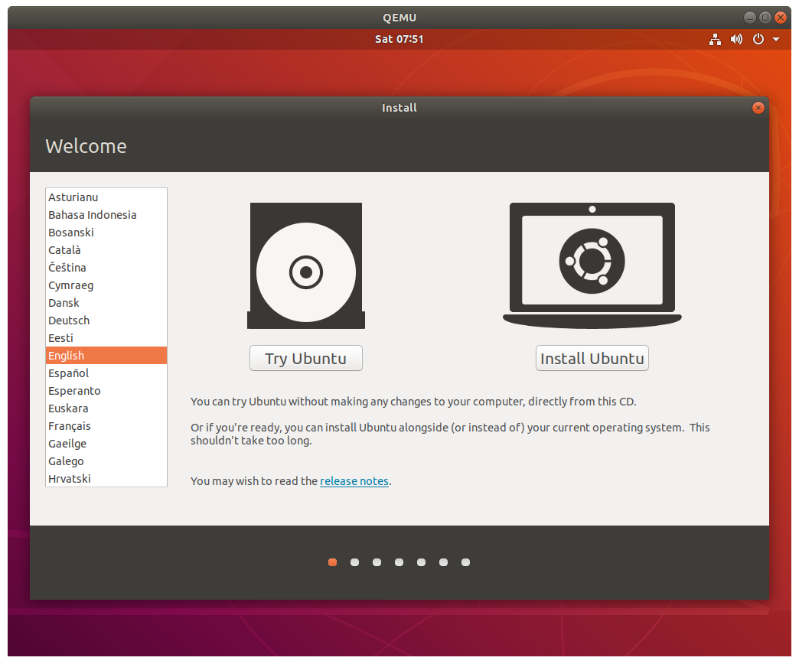
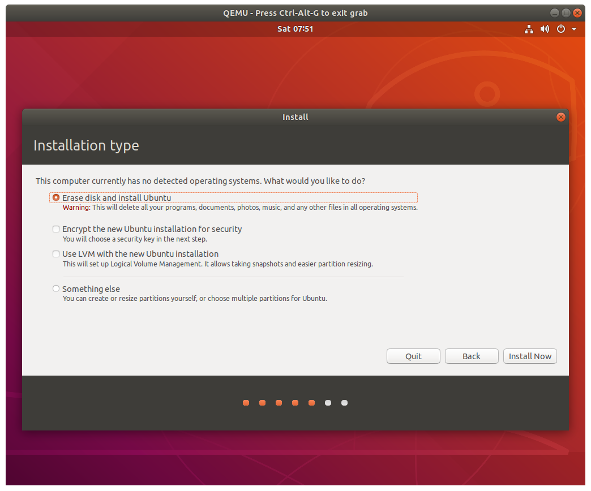
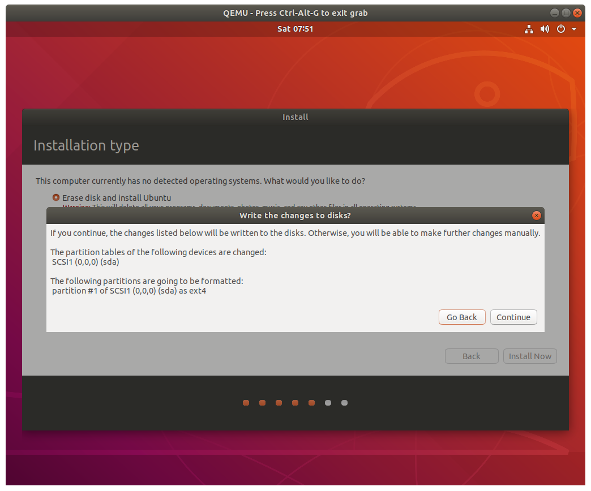
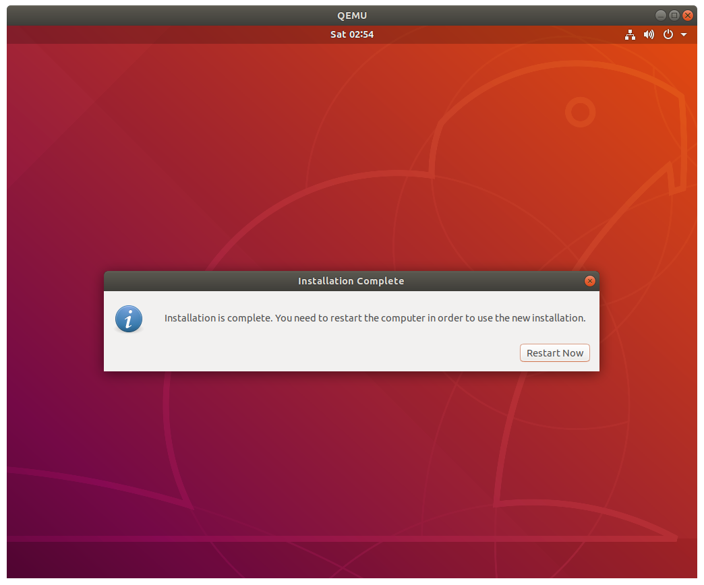

# Setting up ILLIXR in QEMU

## Install QEMU

See the [Install dependencies][13] section for details on installing QEMU.

## Setup Ubuntu in the VM

Run `ILLIXR/qemu/qemu.sh` to download [Ubuntu 22.04][12], create a virtual hard drive
    (`illixr.qcow2`), and launch `qemu`.

Your VM image will be created at `ILLIXR/qemu/illixr.qcow2`.
Ubuntu will be downloaded and saved at `ILLIXR/qemu/ubuntu-22.04.2-desktop-amd64.iso`.

You will be prompted to install Ubuntu;
    follow the instructions and install Ubuntu to the virtual hard drive.

Choose the "erase all" option and confirm:

Pick any account name and password you like.

Once Ubuntu is installed you will be asked to reboot.
Close `qemu` and then run `ILLIXR/qemu/qeum.sh` again to boot into your brand-new Ubuntu install!

## Booting the VM

To launch the VM from now on, just use `ILLIXR/qemu/qemu.sh`.
This will boot from the Ubuntu image we created earlier (`illixr.qcow2`).
Once Ubuntu is installed, it is safe to delete `ubuntu-22.04.2-desktop-amd64.iso`.

## Setting up the VM

Once inside the VM, set up and run ILLIXR as found on the [Getting Started page][10].

## Uninstalling

To delete your local VM, just delete `ILLIXR/qemu/illixr.qcow2`.

`ILLIXR/qemu/ubuntu-22.04.2-desktop-amd64.iso` can be deleted anytime you want after Ubuntu
    is installed to your VM.

If you've deleted `illixr.qcow2`, you can run `ILLIXR/qemu/qemu.sh` to recreate it and reinstall everything.

[//]: # (- Internal -)

[10]:   getting_started.md
[11]:   glossary.md#qemu-kvm
[12]:   glossary.md#ubuntu
[13]:   getting_started.md#pick-the-illixr-plugins-you-want-to-use
